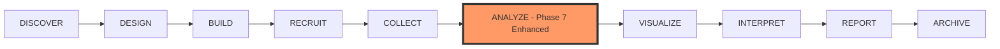

# Phase 7 Modifications: Aligning with Research Lifecycle Navigation

**Created:** September 17, 2025  
**Status:** CRITICAL - Phase 7 needs restructuring to align with Phase 7.5 Navigation  
**Impact:** High - Affects entire user journey and navigation architecture

## 🔴 CRITICAL FINDING: Phase 7 Conflicts with Phase 7.5 Navigation

### Current Issue
Phase 7 creates a "Unified Analysis Hub" as a single mega-page, but Phase 7.5 creates a 10-phase research lifecycle where "ANALYZE" is just ONE phase. This creates:
1. **Navigation Confusion**: Two competing navigation systems
2. **Redundant Work**: Building features that will be reorganized
3. **Poor UX**: Users won't understand where to find features

## 📊 Current Architecture Analysis

### Existing Pages/Features Found:
```
/analysis/                     # Analysis tools hub (8 tools)
/analysis/q-methodology/       # Q-methodology specific
/analytics/                    # Analytics dashboard (separate)
/visualization-demo/           # Visualization components
/ai-tools/                     # AI features
/studies/[id]/                 # Study management
```

### Phase 7.5 Research Lifecycle (10 Phases):
```
1. DISCOVER   → Literature, references, gaps (NEW)
2. DESIGN     → Research questions, hypotheses (NEW)
3. BUILD      → Study creation, grid, questionnaires (EXISTS)
4. RECRUIT    → Participants, invitations (PARTIAL)
5. COLLECT    → Data collection, monitoring (EXISTS)
6. ANALYZE    → Statistical analysis, Q-methodology (EXISTS)
7. VISUALIZE  → Charts, dashboards (EXISTS)
8. INTERPRET  → AI interpretation, insights (NEW)
9. REPORT     → Report generation, export (NEW)
10. ARCHIVE   → Storage, versioning, DOI (NEW)
```

## 🎯 RECOMMENDED PHASE 7 MODIFICATIONS

### OPTION 1: Transform Phase 7 into "ANALYZE Phase Enhancement" (Recommended)
Instead of a "Unified Analysis Hub" that duplicates navigation, Phase 7 should:

#### Modified Scope for Phase 7:
```typescript
// BEFORE: Unified Analysis Hub (Confusing)
/studies/[id]/hub  
  ├── Q-Analysis Tab
  ├── Visualizations Tab  
  ├── Export Tab
  ├── AI Interpretation Tab
  └── Reports Tab

// AFTER: Enhanced ANALYZE Phase (Clear)
/studies/[id]/analyze
  ├── Statistical Analysis
  │   ├── Q-Methodology (enhanced)
  │   ├── Factor Analysis
  │   ├── Correlation Matrix
  │   └── Regression Analysis
  ├── Quick Actions Bar
  │   ├── Export Data
  │   ├── Generate Report
  │   └── AI Insights
  └── Context Panel (study data always available)
```

### OPTION 2: Make Phase 7 the "Study Context Provider" 
Transform Phase 7 into the underlying infrastructure that powers ALL phases:

```typescript
// Phase 7 becomes the data layer for all phases
interface StudyContextProvider {
  studyData: StudyData;           // Loaded once, used everywhere
  analysisResults: AnalysisCache; // Cached results
  aiInterpretations: AICache;     // AI responses cached
  exports: ExportQueue;            // Export management
  
  // Available in ALL phases via context
  useStudyContext(): StudyContext;
  useAnalysisResults(): Results;
  useAIInterpretation(): Interpretation;
}
```

## 📋 DETAILED MODIFICATION PLAN

### Day 1-2: Restructure as ANALYZE Phase Enhancement
**Remove:**
- [ ] Tab navigation system (conflicts with Phase 7.5 toolbar)
- [ ] Unified hub page concept
- [ ] Duplicate navigation elements

**Add:**
- [ ] Enhanced `/studies/[id]/analyze` page
- [ ] Seamless integration with Phase 7.5 navigation
- [ ] Quick access to next phases (VISUALIZE, INTERPRET)

### Day 3-4: Study Context Infrastructure
**Create:**
- [ ] `StudyContextProvider` component
- [ ] Global study data management
- [ ] Cross-phase data sharing
- [ ] Caching layer for expensive operations

### Day 5: Integration Points
**Connect:**
- [ ] ANALYZE → VISUALIZE flow
- [ ] ANALYZE → INTERPRET flow  
- [ ] Export functionality available from any phase
- [ ] AI interpretation overlay (available everywhere)

### Day 6-7: Polish & Testing
**Ensure:**
- [ ] No navigation conflicts
- [ ] Clear user journey
- [ ] Consistent experience
- [ ] Performance optimization

## 🔄 User Journey Flow (Corrected)

### Research Lifecycle with Modified Phase 7:


### Navigation Architecture:
```
Primary Toolbar (Phase 7.5):
┌──────────────────────────────────────────────────────────┐
│ DISCOVER | DESIGN | BUILD | RECRUIT | COLLECT | ANALYZE  │
│ VISUALIZE | INTERPRET | REPORT | ARCHIVE                 │
└──────────────────────────────────────────────────────────┘
                            ↓
                  When ANALYZE selected
                            ↓
Secondary Toolbar (Contextual):
┌──────────────────────────────────────────────────────────┐
│ Q-Method | Factor | Correlation | Regression | Text | ... │
└──────────────────────────────────────────────────────────┘
```

## ✅ Benefits of This Approach

1. **Clear Navigation**: Single, intuitive navigation system
2. **No Redundancy**: Each phase has distinct purpose
3. **Better UX**: Users understand the research journey
4. **Efficient Development**: No wasted work on duplicate navigation
5. **Scalable**: Easy to add new analysis methods
6. **Context Aware**: Study data available everywhere

## 🚨 Action Items for Phase 7

### MUST CHANGE:
1. **Remove "Unified Hub" concept** - Replace with enhanced ANALYZE phase
2. **Remove tab navigation** - Use Phase 7.5 toolbar instead
3. **Change route** - From `/hub` to `/analyze`
4. **Focus on analysis only** - Not visualization or reports

### MUST ADD:
1. **Study context provider** - For cross-phase data sharing
2. **Analysis state management** - Centralized results cache
3. **Quick actions** - Fast access to common tasks
4. **Seamless transitions** - To VISUALIZE and INTERPRET phases

### MUST INTEGRATE:
1. **With Phase 7.5 navigation** - As the ANALYZE phase
2. **With existing components** - Reuse, don't duplicate
3. **With AI features** - Available as overlay/panel

## 📅 Revised Phase 7 Timeline

### Day 1: Architecture Refactor
- Remove hub concept
- Implement as ANALYZE phase
- Set up study context provider

### Day 2: Analysis Tools Integration
- Consolidate Q-methodology
- Add other statistical tools
- Create analysis dashboard

### Day 3: State Management
- Implement analysis cache
- Add results persistence
- Create export queue

### Day 4: Cross-Phase Integration
- Connect to VISUALIZE phase
- Connect to INTERPRET phase
- Add quick navigation

### Day 5: UI Polish
- Enhance analysis UI
- Add loading states
- Implement animations

### Day 6: Testing
- Test navigation flow
- Verify data persistence
- Check performance

### Day 7: Documentation & Deploy
- Update documentation
- Create migration guide
- Deploy with feature flag

## 🎯 Success Metrics

### Navigation Clarity:
- [ ] Users can find analysis tools in <3 clicks
- [ ] Clear progression through research phases
- [ ] No duplicate navigation elements

### Performance:
- [ ] Analysis results cached and reused
- [ ] <100ms phase transitions
- [ ] Study data loaded once per session

### Integration:
- [ ] Seamless flow between phases
- [ ] Data available across all phases
- [ ] Export works from any phase

## 💡 Recommendation Summary

**DO NOT** build Phase 7 as a "Unified Analysis Hub" with its own navigation.

**INSTEAD** build Phase 7 as:
1. **Primary:** Enhanced ANALYZE phase within the 10-phase lifecycle
2. **Secondary:** Study context infrastructure for all phases
3. **Tertiary:** Smart caching and state management layer

This approach:
- Eliminates navigation confusion
- Reduces development time
- Creates better user experience
- Aligns with research best practices
- Makes the platform more intuitive

## Next Steps

1. **Immediate:** Review and approve these modifications
2. **Day 0:** Update Phase 7 planning documents
3. **Day 1:** Begin implementation with new architecture
4. **Ongoing:** Coordinate with Phase 7.5 team for integration

---

**Note:** This modification is critical for platform coherence. The current Phase 7 plan would create a confusing dual-navigation system. These changes align Phase 7 with the superior navigation model of Phase 7.5.