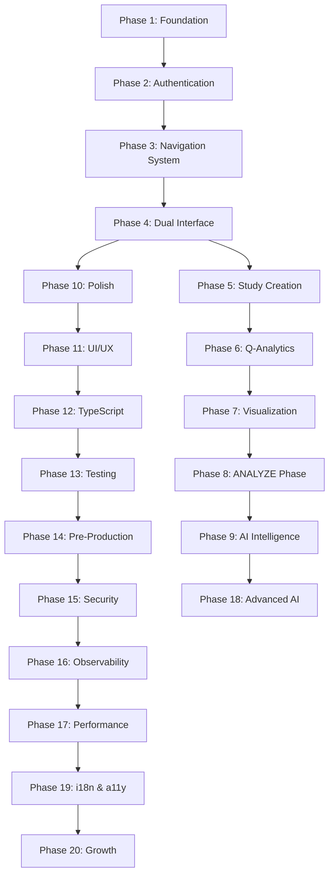

# VQMethod Phase Reorganization - Complete Structure

## Executive Summary
Reorganized 25 phases into 20 logical phases that integrate with Research Lifecycle Navigation System.

---

## NEW PHASE STRUCTURE

### 🏗️ FOUNDATION GROUP (Phases 1-3)
**Purpose:** Establish core infrastructure and navigation architecture

#### Phase 1: Foundation & Design System
- **Status:** ✅ Complete (100%)
- **Original:** Phase 1
- **Description:** TypeScript, Next.js, Apple Design System, testing infrastructure

#### Phase 2: Authentication & Core Backend  
- **Status:** ✅ Complete (100%)
- **Original:** Phase 2
- **Description:** JWT auth, database, security, rate limiting

#### Phase 3: Research Lifecycle Navigation System
- **Status:** ✅ Complete (100%)
- **Original:** Phase 7.5
- **Description:** 10-phase research journey navigation (DISCOVER→ARCHIVE)
- **CRITICAL:** This is now the primary navigation architecture

---

### 🎯 CORE FEATURES GROUP (Phases 4-9)
**Purpose:** Implement essential Q-methodology functionality

#### Phase 4: Dual Interface Architecture
- **Status:** ✅ Complete (100%)
- **Original:** Phase 3
- **Description:** Researcher and participant interfaces

#### Phase 5: Study Creation Excellence
- **Status:** ✅ Complete (100%)
- **Original:** Phase 6.8
- **Description:** Complete study builder with all 8 participant steps

#### Phase 6: Q-Analytics Engine Complete
- **Status:** ✅ Complete (100%)
- **Combines:** Phase 6 + 6.5 + 6.7
- **Description:** Full Q-methodology analysis with backend integration

#### Phase 7: Data Visualization & Analytics
- **Status:** ✅ Complete (100%)
- **Original:** Phase 4
- **Description:** Charts, graphs, real-time dashboards

#### Phase 8: Enhanced ANALYZE Phase & Study Context
- **Status:** 🟡 In Progress (70%)
- **Original:** Phase 7 (transformed from Unified Hub)
- **Description:** Powers the ANALYZE phase in Research Lifecycle

#### Phase 9: AI-Powered Research Intelligence
- **Status:** 🟡 In Progress (60%)
- **Original:** Phase 6.86
- **Description:** AI services for BUILD, INTERPRET, and REPORT phases

---

### ✨ POLISH & QUALITY GROUP (Phases 10-12)
**Purpose:** Professional UI/UX and code quality

#### Phase 10: Professional Polish & Delight
- **Status:** ✅ Complete (100%)
- **Original:** Phase 5
- **Description:** Animations, empty states, micro-interactions

#### Phase 11: UI/UX Excellence & Testing
- **Status:** ✅ Complete (94%)
- **Combines:** Phase 5.5 + 6.6 + 6.85
- **Description:** Complete UI components, navigation excellence, preview features

#### Phase 12: TypeScript Error Reduction
- **Status:** ✅ Complete (90.5%)
- **Original:** Phase 6.94
- **Description:** Reduce TypeScript errors from 1,129 to 47

---

### 🚀 PRODUCTION READINESS GROUP (Phases 13-16)
**Purpose:** Ensure production-grade quality and monitoring

#### Phase 13: Testing Excellence & Infrastructure
- **Status:** ✅ Complete (100%)
- **Combines:** Phase 3.5 + original Phase 14
- **Description:** 90% test coverage, E2E testing, CI/CD pipeline

#### Phase 14: Pre-Production Readiness
- **Status:** 🔴 Not Started (0%)
- **Original:** Phase 10
- **Description:** Production deployment prep, environment configs

#### Phase 15: Advanced Security & Compliance
- **Status:** 🔴 Not Started (0%)
- **Original:** Phase 11
- **Description:** GDPR, HIPAA, SOC 2, penetration testing

#### Phase 16: Observability & SRE
- **Status:** 🔴 Not Started (0%)
- **Original:** Phase 12
- **Description:** Monitoring, alerting, SLOs, incident response

---

### 🌍 ENTERPRISE & GROWTH GROUP (Phases 17-20)
**Purpose:** Scale for enterprise and global reach

#### Phase 17: Performance & Scale Optimization
- **Status:** 🔴 Not Started (0%)
- **Original:** Phase 13
- **Description:** CDN, caching, database optimization

#### Phase 18: Advanced AI Analysis & Reporting
- **Status:** 🔴 Not Started (0%)
- **Original:** Phase 8
- **Description:** Advanced AI features for analysis and reporting

#### Phase 19: Internationalization & Accessibility
- **Status:** 🔴 Not Started (0%)
- **Original:** Phase 15
- **Description:** i18n, WCAG AAA compliance, RTL support

#### Phase 20: Growth & Monetization
- **Status:** 🔴 Not Started (0%)
- **Original:** Phase 16
- **Description:** Billing, subscriptions, analytics, A/B testing

---

## DEPENDENCY CHAIN

---

## INTEGRATION WITH RESEARCH LIFECYCLE

### Primary Navigation (10 Phases)
1. **DISCOVER** - Find research questions
2. **DESIGN** - Plan methodology  
3. **BUILD** - Create study (Phase 5 powers this)
4. **RECRUIT** - Find participants
5. **COLLECT** - Gather Q-sorts
6. **ANALYZE** - Statistical analysis (Phase 8 powers this)
7. **VISUALIZE** - Data visualization (Phase 7 powers this)
8. **INTERPRET** - Make sense of factors (Phase 9 AI helps)
9. **REPORT** - Generate outputs (Phase 9 AI helps)
10. **ARCHIVE** - Store and share

### How Implementation Phases Support Research Phases
- **Phase 3** creates the navigation structure
- **Phase 5** powers BUILD phase
- **Phase 6** powers backend analysis
- **Phase 7** powers VISUALIZE phase  
- **Phase 8** powers ANALYZE phase
- **Phase 9** assists BUILD, INTERPRET, REPORT phases

---

## NEXT IMMEDIATE ACTIONS

### High Priority (Complete These First)
1. **Phase 8**: Enhanced ANALYZE Phase (30% remaining)
   - Complete StudyContextProvider
   - Integrate analysis tools
   - Connect to Research Lifecycle

2. **Phase 9**: AI Intelligence Platform (40% remaining)
   - Integrate StudyContext
   - Position in BUILD phase
   - Enable cross-phase usage

3. **Phase 14**: Pre-Production Readiness (Critical)
   - Environment setup
   - Deployment configuration
   - Production testing

### Required for Launch
- Phase 14: Pre-Production Readiness
- Phase 15: Security & Compliance (for sensitive data)
- Phase 16: Observability (for production monitoring)

### Enhancement Phases (Post-Launch)
- Phase 17: Performance Optimization
- Phase 18: Advanced AI Features
- Phase 19: Internationalization
- Phase 20: Growth & Monetization

---

## BENEFITS OF REORGANIZATION

1. **Logical Grouping**: Related functionality is grouped together
2. **Clear Dependencies**: Each phase builds on previous ones
3. **Navigation Integration**: Full alignment with Research Lifecycle
4. **Reduced Confusion**: No more 6.x sub-phases
5. **Clear Priority**: Groups show what's essential vs enhancement
6. **Better Planning**: Teams can work on group phases in parallel

---

## MIGRATION NOTES

### File/Folder Renaming Not Required
- Keep existing file structure as-is
- Phase numbers are for planning/tracking only
- Code organization remains unchanged

### Documentation Updates Required
- Update PHASE_TRACKER.md with new numbers
- Update any references in code comments
- Update project management tools

### No Code Changes Required
- This is organizational only
- All existing code remains valid
- Focus on completing remaining work

---

**Created:** January 2025  
**Status:** Ready for Implementation  
**Next Step:** Update PHASE_TRACKER.md with this new structure