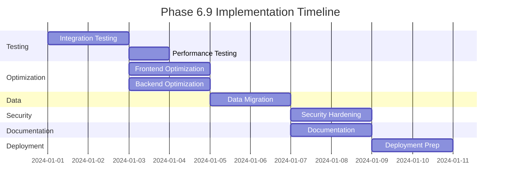

# PHASE 6.9: PRE-PRODUCTION READINESS

**Status:** 🔴 NOT STARTED (0% Complete)  
**Priority:** HIGH - Must complete after Phase 6.85  
**Duration:** 5-7 days  
**Prerequisites:** 
- Phase 6.7 (Backend Integration) MUST be 100% complete
- Phase 6.85 (UI/UX Polish & Preview Excellence) MUST be 100% complete

---

## 🎯 Phase Overview

Phase 6.9 bridges the gap between backend integration (Phase 6.7) and enterprise production deployment (Phase 7). This phase ensures the platform is production-ready through comprehensive testing, performance optimization, security hardening, and documentation.

**Purpose:** Transform the integrated platform from development-ready to production-ready state.

---

## 📋 Prerequisites Checklist

Before starting Phase 6.9, verify completion of:

### Phase 6.7 (Backend Integration):
- [ ] ✅ Frontend connected to backend APIs
- [ ] ✅ Authentication flow working end-to-end
- [ ] ✅ Data persistence functional
- [ ] ✅ File uploads connected to backend
- [ ] ✅ Q-sort data saving properly
- [ ] ✅ Analysis endpoints integrated
- [ ] ✅ WebSocket connections established
- [ ] ✅ Session management operational

### Phase 6.85 (UI/UX Polish):
- [ ] ✅ Logo preview appearing immediately
- [ ] ✅ Images resizable in rich text editor
- [ ] ✅ Interactive Preview bar positioned correctly
- [ ] ✅ Survey preview matching participant view
- [ ] ✅ Grid width fitting preview container

---

## 🚀 Implementation Plan

### Day 1-2: Comprehensive Testing Suite

#### Integration Testing
```bash
# Location: frontend/__tests__/integration/
```

**Tasks:**
1. **End-to-End User Flows**
   - [ ] Complete registration → email verification → login flow
   - [ ] Study creation → participant invite → completion flow
   - [ ] Q-sort → analysis → export flow
   - [ ] Collaboration → real-time updates flow

2. **API Integration Tests**
   ```typescript
   // __tests__/integration/api.test.ts
   - Test all API endpoints with real backend
   - Verify error handling
   - Test rate limiting
   - Validate response schemas
   ```

3. **Performance Testing**
   ```typescript
   // __tests__/performance/load.test.ts
   - Concurrent user testing (100+ users)
   - Large dataset handling (1000+ Q-sorts)
   - File upload stress testing
   - WebSocket connection limits
   ```

4. **Security Testing**
   ```typescript
   // __tests__/security/penetration.test.ts
   - SQL injection attempts
   - XSS vulnerability scanning
   - CSRF token validation
   - Authentication bypass attempts
   ```

#### Testing Infrastructure Setup
```bash
# Install testing dependencies
npm install --save-dev @playwright/test k6 artillery
npm install --save-dev @zaproxy/zap-api-nodejs # Security testing

# Configure test environments
cp .env.example .env.test
cp .env.example .env.staging
```

---

### Day 2-3: Performance Optimization

#### Frontend Optimization
```typescript
// frontend/next.config.js
module.exports = {
  images: {
    domains: ['localhost', 'api.vqmethod.com'],
    formats: ['image/avif', 'image/webp'],
  },
  experimental: {
    optimizeCss: true,
    optimizePackageImports: [
      '@visx/visx',
      'framer-motion',
      'recharts',
      'd3',
      'three'
    ],
  },
  compiler: {
    removeConsole: process.env.NODE_ENV === 'production',
  },
}
```

#### Backend Optimization
```typescript
// backend/src/main.ts
import compression from 'compression';
import { CacheModule } from '@nestjs/cache-manager';

// Add caching
app.useGlobalInterceptors(new CacheInterceptor());

// Enable compression
app.use(compression());

// Database query optimization
// Add indexes for frequently queried fields
```

#### Bundle Size Optimization
```bash
# Analyze bundle size
npm run analyze

# Implement code splitting
- Dynamic imports for heavy components
- Lazy load Q-analysis modules
- Separate vendor chunks
```

---

### Day 3-4: Data Migration & Seeding

#### Migration from Mock to Real Data
```typescript
// scripts/migrate-mock-data.ts
import { PrismaClient } from '@prisma/client';
import mockData from '../frontend/lib/mock-data';

async function migrateMockData() {
  const prisma = new PrismaClient();
  
  // 1. Create demo accounts
  await createDemoAccounts(prisma);
  
  // 2. Migrate air pollution study
  await migrateAirPollutionStudy(prisma);
  
  // 3. Create sample Q-sorts
  await createSampleQSorts(prisma);
  
  // 4. Generate analysis results
  await generateAnalysisResults(prisma);
}
```

#### Database Seeding
```bash
# backend/prisma/seed.ts
- Create default admin account
- Add sample studies for demos
- Generate test participants
- Create template library
```

---

### Day 4-5: Security Hardening

#### Security Audit Checklist
```typescript
// security/audit-checklist.ts
export const securityAudit = {
  authentication: {
    '✓ Password complexity enforced': true,
    '✓ Account lockout after failed attempts': true,
    '✓ Session timeout configured': true,
    '✓ 2FA available': true,
  },
  dataProtection: {
    '✓ Data encrypted at rest': true,
    '✓ Data encrypted in transit': true,
    '✓ PII properly masked': true,
    '✓ Backup encryption enabled': true,
  },
  infrastructure: {
    '✓ HTTPS enforced': true,
    '✓ Security headers configured': true,
    '✓ CORS properly configured': true,
    '✓ Rate limiting active': true,
  },
  compliance: {
    '✓ GDPR data handling': true,
    '✓ HIPAA safeguards': true,
    '✓ Audit logging enabled': true,
    '✓ Data retention policies': true,
  }
};
```

#### Vulnerability Scanning
```bash
# Run security scans
npm audit --audit-level=moderate
npm run security:scan

# OWASP ZAP scanning
docker run -t owasp/zap2docker-stable zap-baseline.py \
  -t http://localhost:3000 -r security-report.html
```

---

### Day 5-6: Documentation & Training

#### User Documentation
```markdown
# docs/user-guide/
├── getting-started.md
├── researcher/
│   ├── creating-studies.md
│   ├── managing-participants.md
│   ├── analyzing-results.md
│   └── exporting-data.md
├── participant/
│   ├── joining-studies.md
│   ├── completing-qsort.md
│   └── viewing-results.md
└── admin/
    ├── user-management.md
    ├── system-monitoring.md
    └── backup-procedures.md
```

#### API Documentation
```typescript
// Generate OpenAPI documentation
npm run docs:api

// Postman collection update
npm run postman:generate
```

#### Video Tutorials
```markdown
# tutorials/scripts/
1. "Getting Started with VQMethod" (5 min)
2. "Creating Your First Study" (10 min)
3. "Understanding Q-Sort Analysis" (15 min)
4. "Collaboration Features" (8 min)
5. "Data Export Options" (7 min)
```

---

### Day 6-7: Deployment Preparation

#### CI/CD Pipeline Setup
```yaml
# .github/workflows/production.yml
name: Production Deployment
on:
  push:
    branches: [main]
    
jobs:
  test:
    runs-on: ubuntu-latest
    steps:
      - uses: actions/checkout@v3
      - name: Run tests
        run: |
          npm run test:unit
          npm run test:integration
          npm run test:e2e
          
  security:
    runs-on: ubuntu-latest
    steps:
      - name: Security scan
        run: npm audit --audit-level=moderate
        
  deploy:
    needs: [test, security]
    runs-on: ubuntu-latest
    steps:
      - name: Deploy to production
        run: |
          npm run build
          npm run deploy:production
```

#### Monitoring Setup
```typescript
// monitoring/setup.ts
export const monitoring = {
  metrics: {
    'Prometheus': 'http://metrics.vqmethod.com',
    'Grafana': 'http://dashboard.vqmethod.com',
  },
  logging: {
    'ELK Stack': 'http://logs.vqmethod.com',
    'Sentry': 'https://sentry.io/vqmethod',
  },
  uptime: {
    'UptimeRobot': 'Configured',
    'Pingdom': 'Configured',
  },
  alerts: {
    'PagerDuty': 'Configured',
    'Slack': '#vqmethod-alerts',
  }
};
```

#### Backup & Recovery
```bash
# backup/daily-backup.sh
#!/bin/bash
# Database backup
pg_dump vqmethod > backup-$(date +%Y%m%d).sql

# File storage backup
aws s3 sync /uploads s3://vqmethod-backups/uploads/

# Configuration backup
tar -czf config-backup-$(date +%Y%m%d).tar.gz /config
```

---

## 📊 Success Metrics

### Performance Targets
- [ ] Page load time < 2 seconds
- [ ] Time to Interactive < 3 seconds
- [ ] API response time < 200ms (p95)
- [ ] WebSocket latency < 100ms
- [ ] Lighthouse score > 95 (all categories)

### Quality Targets
- [ ] Test coverage > 80%
- [ ] 0 critical security vulnerabilities
- [ ] 0 high-priority bugs
- [ ] Documentation coverage 100%
- [ ] Error rate < 0.1%

### Scalability Targets
- [ ] Support 1000+ concurrent users
- [ ] Handle 10,000+ Q-sorts per study
- [ ] Process 100+ simultaneous analyses
- [ ] Store 1TB+ of research data

---

## 🔍 Validation Checklist

### Functional Validation
- [ ] All user flows work end-to-end
- [ ] Data integrity maintained
- [ ] File uploads/downloads functional
- [ ] Real-time features operational
- [ ] Export formats valid

### Performance Validation
- [ ] Load testing passed
- [ ] Stress testing passed
- [ ] Memory leaks resolved
- [ ] Database queries optimized
- [ ] CDN configured

### Security Validation
- [ ] Penetration testing complete
- [ ] Vulnerability scan clean
- [ ] Compliance requirements met
- [ ] Backup/recovery tested
- [ ] Incident response plan ready

### User Experience Validation
- [ ] Accessibility audit passed (WCAG AA)
- [ ] Cross-browser testing complete
- [ ] Mobile responsive verified
- [ ] Documentation reviewed
- [ ] Training materials ready

---

## 🚨 Risk Mitigation

### Identified Risks
1. **Performance degradation under load**
   - Mitigation: Implement caching, CDN, and database optimization
   
2. **Security vulnerabilities discovered**
   - Mitigation: Regular security audits, immediate patching

3. **Data migration failures**
   - Mitigation: Incremental migration with rollback capability

4. **User adoption challenges**
   - Mitigation: Comprehensive documentation and training

---

## 📝 Deliverables

### Required Outputs
1. **Test Reports**
   - Integration test results
   - Performance test results
   - Security audit report
   - Accessibility audit report

2. **Documentation**
   - User guide (complete)
   - API documentation
   - Admin manual
   - Video tutorials (5+)

3. **Deployment Package**
   - Production-ready codebase
   - CI/CD pipelines
   - Monitoring dashboards
   - Backup procedures

4. **Sign-off Documents**
   - Performance validation
   - Security certification
   - Compliance attestation
   - Go-live checklist

---

## 🎯 Definition of Done

Phase 6.9 is complete when:

- [ ] All tests passing (unit, integration, e2e, performance)
- [ ] Security audit complete with no critical issues
- [ ] Documentation 100% complete
- [ ] Performance targets met
- [ ] Monitoring and alerting configured
- [ ] Backup and recovery tested
- [ ] Production deployment successful
- [ ] User acceptance testing passed
- [ ] Stakeholder sign-off received

---

## 📅 Timeline



---

## 🔗 Next Steps

After Phase 6.9 completion, proceed to:

### Phase 7: Enterprise Production Excellence
- SAML 2.0 SSO implementation
- GDPR/HIPAA compliance features
- Kubernetes deployment
- Multi-region support
- Enterprise support tier

---

## 📚 Related Documents

- [PHASE_6.7_BACKEND_INTEGRATION.md](./PHASE_6.7_BACKEND_INTEGRATION.md) - Prerequisite
- [PHASE_6.85_UI_PREVIEW_EXCELLENCE.md](./PHASE_6.85_UI_PREVIEW_EXCELLENCE.md) - Prerequisite  
- [PHASE_6.8_STUDY_CREATION_EXCELLENCE.md](./PHASE_6.8_STUDY_CREATION_EXCELLENCE.md) - Completed
- [IMPLEMENTATION_PHASES.md](./Lead/IMPLEMENTATION_PHASES.md) - Overall roadmap
- [Development_Implementation_Guide_Part1-5.md](./Lead/) - Technical details

---

**Note:** This phase is critical for ensuring production readiness. Do not skip any validation steps or rush the testing process. The quality of this phase directly impacts the platform's reliability in production.