# 🛡️ Phase 6.86 Day 0-1 Enhanced Error Guard System

**Purpose:** Comprehensive error prevention and monitoring for critical AI implementation setup  
**Baseline:** 47 TypeScript errors (MUST NOT EXCEED)  
**Standard:** Zero new errors introduced

---

## 📅 Day 0 Enhanced Guards (Setup Day)

### 🚀 Pre-Flight Checklist (8:00 AM)
```bash
# Run this BEFORE starting Day 0
./scripts/phase-6.86-preflight.sh
```

- [ ] Current TypeScript errors = 47 (document exact count)
- [ ] All dependencies up to date
- [ ] No uncommitted changes
- [ ] .env.local backed up (if exists)
- [ ] VS Code TypeScript version = workspace version
- [ ] Git branch created: `feature/phase-6.86-ai`

### ⏰ Hourly Checkpoints
| Time | Task | Validation | Errors |
|------|------|------------|---------|
| 9:00 AM | Start setup | Baseline check | ≤47 ✅/❌ |
| 10:00 AM | OpenAI config | API key valid | ≤47 ✅/❌ |
| 11:00 AM | Type definitions | Types compile | ≤47 ✅/❌ |
| 12:00 PM | **Major Check** | Full validation | ≤47 ✅/❌ |
| 2:00 PM | Environment setup | .env validated | ≤47 ✅/❌ |
| 3:00 PM | Package installs | No conflicts | ≤47 ✅/❌ |
| 4:00 PM | Error tracking | Logs created | ≤47 ✅/❌ |
| 5:00 PM | **EOD Check** | Complete audit | ≤47 ✅/❌ |

### 🔧 Continuous Monitoring Script
```bash
#!/bin/bash
# Save as: scripts/day0-monitor.sh

# Real-time type watching
watch_types() {
  npx tsc --watch --noEmit --preserveWatchOutput | while read line; do
    if [[ $line == *"error TS"* ]]; then
      echo "⚠️ TYPE ERROR DETECTED: $line"
      notify-send "TypeScript Error" "$line" # Desktop notification
    fi
  done &
  WATCH_PID=$!
  echo "Type watcher started (PID: $WATCH_PID)"
}

# Start monitoring
watch_types

# Cleanup on exit
trap "kill $WATCH_PID 2>/dev/null" EXIT
```

### 📝 Type Definition Guards
```typescript
// frontend/lib/types/ai.types.ts
// MANDATORY: Define ALL types before implementation

import { z } from 'zod';

// Runtime validation schemas
export const AIRequestSchema = z.object({
  prompt: z.string().min(1).max(4000),
  model: z.enum(['gpt-4', 'gpt-3.5-turbo']),
  context: z.record(z.any()).optional(),
  maxTokens: z.number().max(4000).default(500),
  temperature: z.number().min(0).max(1).default(0.7)
});

export const AIResponseSchema = z.object({
  content: z.string(),
  tokens: z.number(),
  cost: z.number(),
  cached: z.boolean().default(false)
});

// Type guards
export function isAIRequest(obj: unknown): obj is AIRequest {
  return AIRequestSchema.safeParse(obj).success;
}

export function isAIResponse(obj: unknown): obj is AIResponse {
  return AIResponseSchema.safeParse(obj).success;
}

// Export types
export type AIRequest = z.infer<typeof AIRequestSchema>;
export type AIResponse = z.infer<typeof AIResponseSchema>;
```

### 🔌 API Connection Guards
```typescript
// frontend/lib/services/ai-guard.service.ts
// Test API connection with type safety

export class AIGuardService {
  private static async testConnection(): Promise<boolean> {
    try {
      const testRequest: AIRequest = {
        prompt: "Say 'OK' if you receive this",
        model: 'gpt-3.5-turbo',
        maxTokens: 10
      };
      
      // Validate request before sending
      if (!isAIRequest(testRequest)) {
        throw new Error('Invalid request format');
      }
      
      const response = await this.callAPI(testRequest);
      
      // Validate response
      if (!isAIResponse(response)) {
        throw new Error('Invalid response format');
      }
      
      return response.content.includes('OK');
    } catch (error) {
      console.error('API connection test failed:', error);
      return false;
    }
  }
  
  static async initialize(): Promise<void> {
    const connected = await this.testConnection();
    if (!connected) {
      console.warn('⚠️ Using mock API service');
      this.useMockService();
    }
  }
}
```

---

## 📅 Day 1 Enhanced Guards (Core AI Service Day)

### 🎯 Service Creation Checkpoints
Each service creation follows this validation flow:

```mermaid
graph LR
  A[Create Service] --> B[Type Check]
  B --> C[Unit Test]
  C --> D[Integration Check]
  D --> E[Error Count]
  E --> F{Errors ≤47?}
  F -->|Yes| G[Commit]
  F -->|No| H[Rollback & Fix]
  H --> B
```



### ⏱️ Enhanced Check Schedule
| Time | Service/Task | Validation Required | Max Errors |
|------|--------------|-------------------|------------|
| 9:00 AM | Start | Baseline + setup | 47 |
| 9:30 AM | ai.service.ts started | Types defined | 47 |
| 10:30 AM | ai.service.ts complete | Service validated | 47 |
| 11:00 AM | Error handling added | Tests passing | 47 |
| 12:00 PM | **Noon Check** | Full suite | 47 |
| 1:00 PM | Cost tracking added | Function typed | 47 |
| 2:00 PM | Rate limiting added | Integration test | 47 |
| 3:00 PM | Tests written | 5 tests passing | 47 |
| 4:00 PM | Error boundaries | Error handling works | 47 |
| 5:00 PM | **EOD Check** | Complete validation | 47 |

### 🔍 Incremental Validation Functions
```bash
#!/bin/bash
# Save as: scripts/day1-validate.sh

# After each function/method addition
validate_increment() {
  local file=$1
  local function_name=$2
  
  echo "Validating ${function_name} in ${file}..."
  
  # 1. Syntax check
  npx tsc --noEmit "$file" || return 1
  
  # 2. No 'any' check
  if grep -q ": any" "$file"; then
    echo "⚠️ Warning: 'any' type used in ${function_name}"
  fi
  
  # 3. Return type check
  if ! grep -q "${function_name}.*:.*{" "$file"; then
    echo "❌ Error: No return type for ${function_name}"
    return 1
  fi
  
  # 4. Error count check
  ERROR_COUNT=$(npm run typecheck 2>&1 | grep -c "error TS")
  if [ $ERROR_COUNT -gt 47 ]; then
    echo "❌ CRITICAL: Errors increased to $ERROR_COUNT"
    echo "Fix before proceeding!"
    return 1
  fi
  
  echo "✅ ${function_name} validated (Errors: $ERROR_COUNT/47)"
  return 0
}

# Use after each addition:
# validate_increment "frontend/lib/services/ai.service.ts" "generateResponse"
```

### 🧪 Test-Driven Guards
```typescript
// frontend/lib/services/__tests__/ai.service.guard.test.ts
// Run these tests continuously during Day 1

describe('AI Service Type Guards', () => {
  beforeEach(() => {
    // Reset error count
    global.typeErrorCount = 0;
  });

  test('OpenAI client wrapper has proper types', () => {
    const service = new AIService();
    // This will fail to compile if types are wrong
    const typed: AIService = service;
    expect(typed).toBeDefined();
  });

  test('Error handling preserves types', () => {
    const error: AIError = {
      code: 'TEST',
      message: 'Test error',
      retry: false
    };
    expect(isAIError(error)).toBe(true);
  });

  test('Retry logic maintains type safety', async () => {
    const request: AIRequest = {
      prompt: 'test',
      model: 'gpt-3.5-turbo'
    };
    // This ensures retry returns correct type
    const response: AIResponse = await service.callWithRetry(request);
    expect(isAIResponse(response)).toBe(true);
  });

  test('Cost tracking returns numbers', () => {
    const cost: number = service.calculateCost(100);
    expect(typeof cost).toBe('number');
  });

  test('Rate limiting preserves request types', async () => {
    const limited: AIRequest = await service.applyRateLimit({
      prompt: 'test',
      model: 'gpt-3.5-turbo'
    });
    expect(isAIRequest(limited)).toBe(true);
  });
});
```

### 🚨 Emergency Procedures
```bash
# If errors exceed 47 at any point:

# 1. IMMEDIATE STOP
echo "❌ STOPPING: Error count exceeded baseline"

# 2. Capture current state
npm run typecheck > error-dump-$(date +%s).log

# 3. Stash changes
git stash save "Emergency stash - errors exceeded"

# 4. Analyze error patterns
grep "error TS" error-dump-*.log | sort | uniq -c | sort -rn

# 5. Fix most common errors first
npm run fix:types

# 6. If still failing, rollback
git checkout .

# 7. Start incremental approach
# Add code in smaller chunks, validate each
```

---

## 📊 Real-Time Monitoring Dashboard

### VS Code Setup for Day 0-1
```json
// .vscode/settings.json
{
  "typescript.tsserver.experimental.enableProjectDiagnostics": true,
  "typescript.tsserver.watchOptions": {
    "watchFile": "priorityPollingInterval",
    "watchDirectory": "dynamicPriorityPolling"
  },
  "editor.formatOnSave": true,
  "editor.codeActionsOnSave": {
    "source.fixAll.ts": true
  },
  "typescript.preferences.includeInlayParameterNameHints": "all",
  "typescript.preferences.includeInlayParameterNameHintsWhenArgumentMatchesName": true,
  
  // Custom error monitoring
  "errorLens.enabled": true,
  "errorLens.errorColor": "#ff0000",
  "errorLens.warningColor": "#ffaa00",
  "errorLens.statusBarColorsEnabled": true,
  "errorLens.statusBarMessageEnabled": true,
  
  // Auto-fix on save
  "typescript.suggest.autoImports": true,
  "typescript.updateImportsOnFileMove.enabled": "always"
}
```

### Terminal Monitoring Setup
```bash
# Run in split terminal during Day 0-1

# Terminal 1: Continuous type checking
npm run typecheck -- --watch

# Terminal 2: Error count monitor
watch -n 60 'npm run typecheck 2>&1 | grep -c "error TS"'

# Terminal 3: Test runner
npm run test:watch

# Terminal 4: Dev server with strict mode
npm run dev:strict
```

---

## ✅ Success Criteria

### Day 0 Complete When:
- [ ] All type definitions created and compile
- [ ] Mock API service works as fallback
- [ ] OpenAI connection tested (or mock active)
- [ ] Error tracking system operational
- [ ] TypeScript errors ≤ 47
- [ ] All hourly checks passed
- [ ] Git commit: "Phase 6.86 Day 0: Setup complete - 47 errors maintained"

### Day 1 Complete When:
- [ ] AIService class fully implemented
- [ ] All methods have proper return types
- [ ] Error handling with recovery works
- [ ] Cost tracking functional
- [ ] Rate limiting active
- [ ] 5+ unit tests passing
- [ ] TypeScript errors ≤ 47
- [ ] All checkpoints passed
- [ ] Git commit: "Phase 6.86 Day 1: AI Service complete - 47 errors maintained"

---

## 🔄 Continuous Improvement
After Day 1, update this guide with:
- New error patterns discovered
- Successful prevention strategies
- Time-saving validation scripts
- Team feedback on guard effectiveness

---

*This enhanced guard system is MANDATORY for Phase 6.86 Day 0-1 implementation*