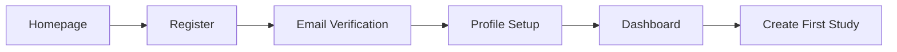
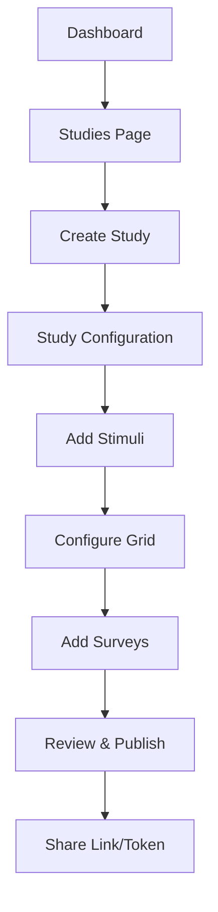
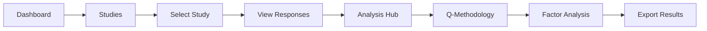
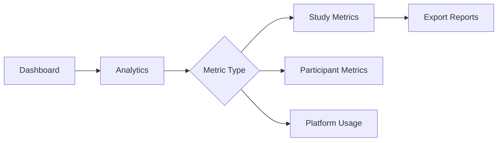
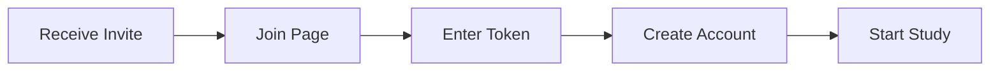
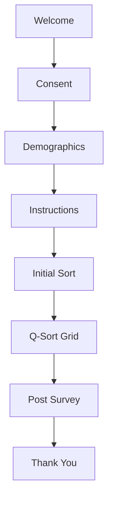
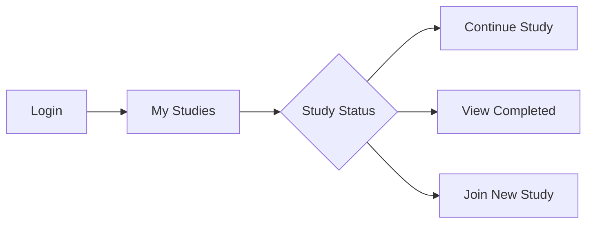
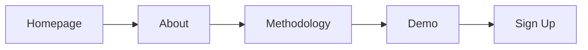
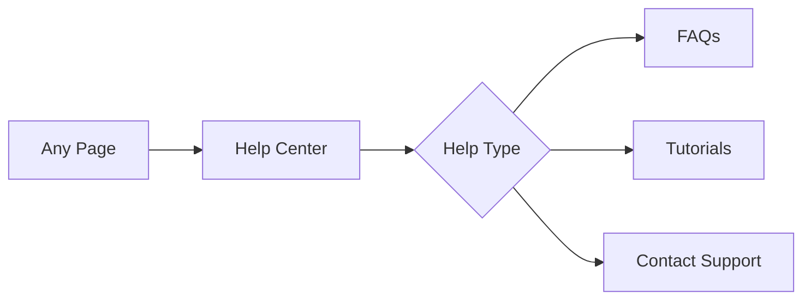

# User Journey Documentation

## 🎯 Complete User Journey Mapping for VQMethod Platform

### Overview

This document maps all user journeys through the VQMethod platform, ensuring clear navigation paths and optimal user experience.

---

## 🧑‍🔬 Researcher Journey

### Journey 1: First-Time Researcher Setup



**Steps:**

1. **Homepage** → Click "Get Started" or "Register"
2. **Registration** → Fill form with email, password, institution
3. **Email Verification** → Check email, click verification link
4. **Profile Setup** → Add institution details, research interests
5. **Dashboard** → View empty dashboard with onboarding tips
6. **Create Study** → Guided study creation wizard

### Journey 2: Creating a Q-Sort Study



**Steps:**

1. **Dashboard** → Click "Studies" in navigation
2. **Studies List** → Click "Create New Study"
3. **Study Details** → Enter title, description, consent
4. **Stimuli Upload** → Add 25-50 statements/images
5. **Grid Configuration** → Set distribution (-4 to +4)
6. **Pre/Post Surveys** → Add demographic questions
7. **Review** → Preview participant experience
8. **Publish** → Get shareable link and token

### Journey 3: Analyzing Study Results



**Steps:**

1. **Dashboard** → View study with responses
2. **Studies** → Click study with 30+ responses
3. **Study Details** → Click "Analyze Results"
4. **Analysis Hub** → Select "Q-Methodology Analysis"
5. **Upload Data** → Select study data
6. **Factor Extraction** → Run PCA/Centroid
7. **Rotation** → Apply Varimax rotation
8. **Export** → Download CSV/PDF report

### Journey 4: Viewing Analytics



**Navigation Path:**

- `/dashboard` → `/analytics` → Select metrics → Export

---

## 👥 Participant Journey

### Journey 1: Joining a Study



**Steps:**

1. **Email/Link** → Click study invitation
2. **Join Page** → Enter study token
3. **Registration** → Quick signup (email only)
4. **Consent** → Read and accept
5. **Begin Study** → Start Q-sort process

### Journey 2: Completing Q-Sort



**8-Step Process:**

1. **Welcome** → Study introduction
2. **Consent** → Agreement to participate
3. **Demographics** → Basic information
4. **Instructions** → How to sort cards
5. **Initial Sort** → Agree/Disagree/Neutral
6. **Q-Sort** → Place on grid (-4 to +4)
7. **Reflection** → Comment on extremes
8. **Completion** → Thank you & next steps

### Journey 3: Returning Participant



**Navigation:**

- `/auth/login` → `/my-studies` → Select action

---

## 🌐 Public Visitor Journey

### Journey 1: Learning About Q-Methodology



**Path:** `/` → `/about` → `/visualization-demo` → `/auth/register`

### Journey 2: Getting Help



**Path:** `[Any]` → `/help` → Select topic → `/contact`

---

## 🔄 Cross-Journey Transitions

### Researcher ↔ Analytics

```
Dashboard → Studies → Study Details → Analytics → Analysis → Q-Methodology
    ↑                                      ↓           ↓              ↓
    └──────────────────────────────────────┴───────────┴──────────────┘
```

### Error Recovery Paths

```
Error Page → Dashboard (if authenticated)
          → Homepage (if not authenticated)
          → Previous Page (browser back)
          → Help Center (for assistance)
```

---

## 🎯 Key Navigation Principles

### 1. **Always Accessible**

- Logo → Homepage
- User Menu → Profile/Settings/Logout
- Help → Available from any page

### 2. **Context Preservation**

- Breadcrumbs show current location
- Back button preserves form data
- Session persists across tabs

### 3. **Role-Based Visibility**

- Researchers see: Studies, Analytics, Analysis
- Participants see: My Studies, Join
- Public sees: About, Help, Demo

### 4. **Progressive Disclosure**

- Simple paths for new users
- Advanced features discoverable
- Tooltips explain complex features

---

## 🚀 Quick Access Paths

### Researcher Quick Actions

- **Create Study:** `/dashboard` → Quick Action Button
- **View Analytics:** `/dashboard` → Analytics Card
- **Analyze Data:** `/studies/[id]` → Analyze Button

### Participant Quick Actions

- **Join Study:** Homepage → Join Study Button
- **Continue Study:** `/my-studies` → Continue Button
- **View Results:** `/my-studies/[id]` → Results Tab

### Admin Quick Actions

- **System Health:** `/admin` → Monitoring
- **User Management:** `/admin/users`
- **Support Tickets:** `/admin/support`

---

## 📊 Success Metrics

### Navigation Success Indicators

- **Task Completion Rate:** >90%
- **Time to Complete:** <3 minutes for primary tasks
- **Error Rate:** <5% navigation errors
- **Bounce Rate:** <30% from landing pages

### User Satisfaction Metrics

- **Navigation Clarity:** 4.5/5 rating
- **Feature Discoverability:** >80%
- **Help Usage:** <10% (indicates intuitive design)

---

## 🔍 Testing Scenarios

### Critical Paths to Test

1. **New User Registration → First Study Creation**
2. **Participant Join → Study Completion**
3. **Study Creation → Data Analysis → Export**
4. **Dashboard → Analytics → Analysis → Q-Methodology**
5. **Error Recovery → Return to Task**

### Edge Cases

- Session timeout during study
- Network disconnection during save
- Invalid study token entry
- Concurrent study participation
- Browser back/forward navigation

---

## 📱 Mobile Journey Adaptations

### Mobile-Specific Considerations

- Hamburger menu for navigation
- Touch gestures for Q-sort
- Simplified forms for small screens
- Progressive disclosure for complex features
- Offline mode for study participation

### Responsive Breakpoints

- **Mobile:** <768px - Single column, stacked navigation
- **Tablet:** 768-1024px - Two column, condensed navigation
- **Desktop:** >1024px - Full navigation, multi-column layout

---

## 🎨 Visual Journey Indicators

### Progress Indicators

- Step counters (1 of 8)
- Progress bars
- Breadcrumbs
- Active navigation highlighting
- Completion checkmarks

### Status Indicators

- Study status badges (Active/Complete/Draft)
- Response count badges
- New feature badges
- Warning/Error states
- Success confirmations
